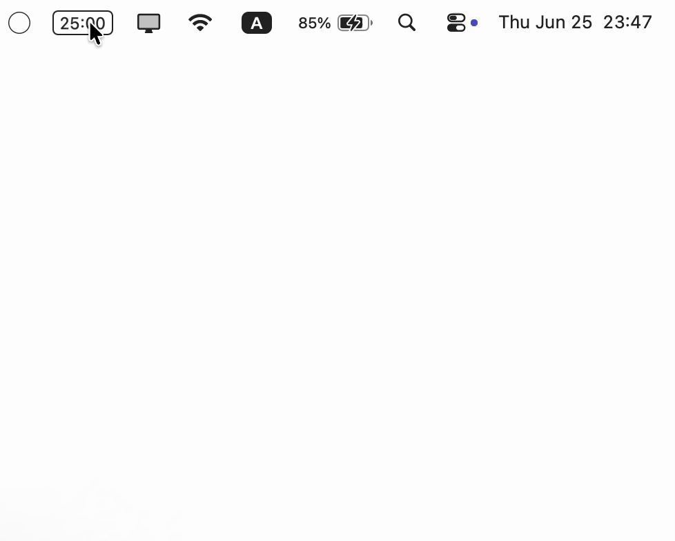

# Pomo

A lightweight **menu bar Pomodoro timer** for macOS, built with SwiftUI. It lives
entirely in the menu bar (no Dock icon): click the live countdown to open a
popover with a scrubber, quick presets, and start/pause — and it auto-cycles
through focus and break phases.

> **Looking for Linux?** A Linux version of this project is available at
> [TheOriginalMehrdad/linux-pomodoro](https://github.com/TheOriginalMehrdad/linux-pomodoro).



## Features

- **Classic Pomodoro cycle** — focus → short break → focus, with a long break
  every _N_ sessions. Phases auto-chain (optional) and ring an alarm at zero.
- **Menu bar pill** — live `MM:SS` countdown, or a compact icon-only mode.
- **Scrubber + presets** — drag the tick ruler or tap a preset chip to set the
  focus length.
- **Configurable** (⌘,) — focus / short-break / long-break lengths, sessions per
  long break, three editable presets, alarm volume, "auto-mute after 5 seconds",
  menu-bar display mode, increased contrast, and launch at login.
- **Alarm** — bundled looping tone with volume control and a Test button.

## Requirements

- macOS 26+ and Xcode 26+ (Swift 5/6 toolchain).

## Build & run

Open `Pomo.xcodeproj` in Xcode and run the **Pomo** scheme, or from the command
line:

```sh
xcodebuild -project Pomo.xcodeproj -scheme Pomo -configuration Release \
  -destination 'platform=macOS' build
```

The app is configured as a menu-bar agent (`LSUIElement`), so it has no Dock
icon — look for the timer in the top-right menu bar after launching.

## Project layout

```
Pomo/
  PomoApp.swift          # App entry: MenuBarExtra + Settings scenes
  Models/                # AppSettings (UserDefaults), TimerEngine (cycle logic)
  Views/                 # MenuBarLabel, TimerPopoverView, ScrubberView,
                         #   PresetChipsView, SettingsView
  Services/              # AlarmPlayer, LaunchAtLogin, Notifier
  alarm.wav              # original generated alarm tone
  Assets.xcassets/       # app icon
```

## Notes

- The app is **ad-hoc signed** for personal use. Distributing it to other Macs
  will trigger a Gatekeeper "unidentified developer" warning (right-click →
  **Open** to bypass); a paid Apple Developer ID removes that.
- The bundled `alarm.wav` is an original synthesized tone, not a system sound.

## License

Released under the [MIT License](LICENSE).
